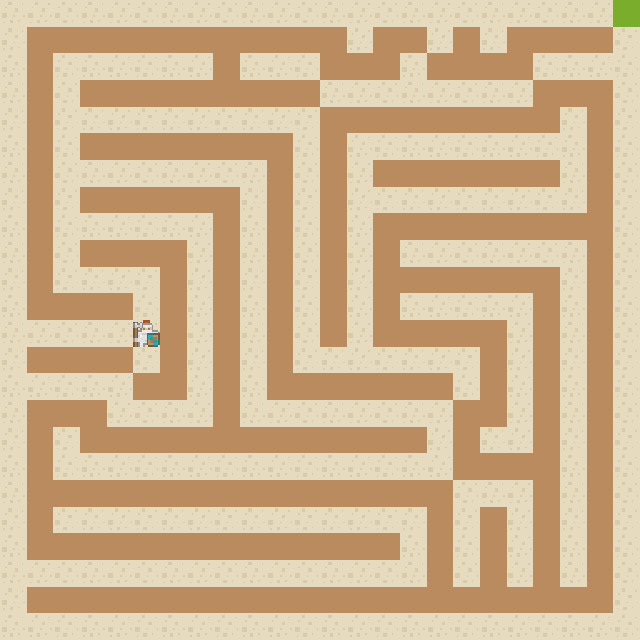

# Move a puck through a maze

This is a small demo I used to get familiar with the
[pixel](https://github.com/faiface/pixel) game engine and using Bazel
to build and release game binaries.

Sprites: Roguelike/RPG pack from [kenney](http://kenney.nl/) AKA
"Asset Jesus"

Creates a grid-based maze. Use the arrow keys (←↑↓→) to move
the player to the green tile. Reaching the green tile resets the game
with a new maze. Press 'Escape' to close the window.

## Building from source

### Using bazel

[Bazel](https://bazel.build/) is used to implement reproducible builds.

1. [Install bazel](https://docs.bazel.build/versions/master/install.html)
1. Make sure you have a C compiler installed.
1. Build the binary:

	bazel build :mazewalker

The final binary can be found in `bazel-bin`.

### Using `go` tool

Using `go get` is more accessible, but is prone to breakage if
dependencies change.

1. Install requirements for the [pixel][1] graphics library (copied here):
  ** macOS: `xcode-select --install`
  ** Ubuntu/Debian: `sudo apt-get install libgl1-mesa-dev xorg-dev`
  ** CentOS/Fedora/RHEL: `sudo yum install libX11-devel libXcursor-devel
     libXrandr-devel libXinerama-devel mesa-libGL-devel libXi-devel`
1. Fetch the package: `go get aqwari.net/game/mazewalker`

[1]: https://github.com/faiface/pixel/tree/225de575de3a6e6ba6774cad8dda44ae8d5cbbf4#requirements

## Updating assets

The sprite sheets are compiled into the binary. The Go source files
are generated using bazel, and you'll need to have it installed to
switch the sprites.

	bazel build :assets
	cp ../bazel-bin/mazewalker/assets.go .
